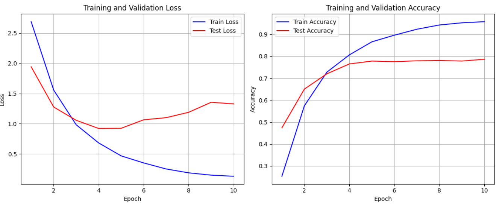
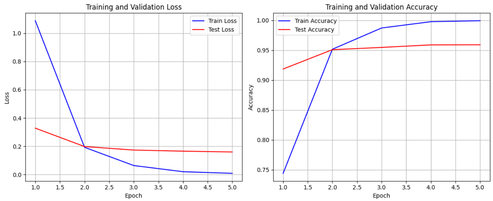
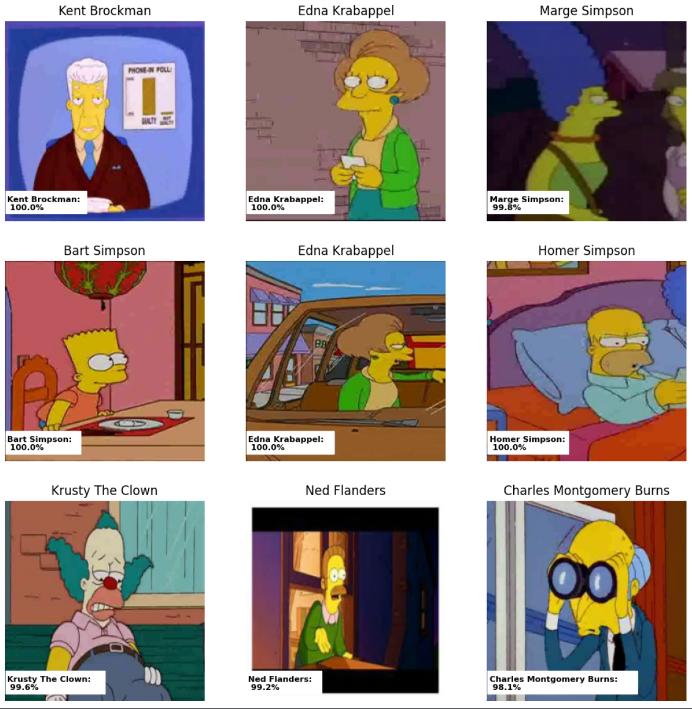

# Simpsons Character Classification

Image classification of **The Simpsons** characters using Convolutional Neural Networks and Transfer Learning with PyTorch.

## Project Overview

The goal of this project is to classify characters from *The Simpsons* TV series based on their images. Several deep learning approaches were implemented and compared, including a custom Convolutional Neural Network (CNN) and transfer learning with pretrained models.

The project was completed as part of studying Computer Vision and deep learning with PyTorch.

---

## Dataset

The dataset contains labeled images of Simpsons characters.

* **Task:** Multi-class image classification
* **Framework:** PyTorch
* **Evaluation metric:** Kaggle Public Score

---

## Models

### 1. Custom CNN

A convolutional neural network built from scratch using PyTorch.

Architecture includes:

* Convolutional layers
* ReLU activation
* Max Pooling
* Fully Connected layers

**Kaggle Score:** **0.919**

---

### 2. Transfer Learning

A pretrained convolutional neural network was fine-tuned on the Simpsons dataset.

Training included:

* Transfer Learning
* Fine-tuning
* Data Augmentation
* Learning Rate Scheduling

**Kaggle Score:** **0.98618**

---

## Results

| Model             | Kaggle Score |
| ----------------- | -----------: |
| Custom CNN        |        0.91 |
| Transfer Learning |  **0.98** |

Transfer learning significantly outperformed the custom CNN and achieved a substantial improvement in classification accuracy.

---

## Project Structure

```text
CV_Simpsons_classification/
│
├── data/               # train and test datasets
├── images/             # Images for README
├── models/             # Saved model weights (optional)
├── submissions/        
├── requirements.txt
├── README.md
└── .gitignore
```

---

## Technologies

* Python
* PyTorch
* Torchvision
* NumPy
* Pandas
* Matplotlib
* Scikit-learn
* Jupyter Notebook

---

## Experiments

The following approaches were investigated:

* Building a CNN from scratch
* Transfer Learning
* Fine-tuning pretrained models
* Data augmentation
* Hyperparameter tuning

---
## Train/validation loss

### CNN 


### Fine Tuning


---

## Example of predictions




## Author

**Dari Dorzhieva**

GitHub: https://github.com/LordGum

